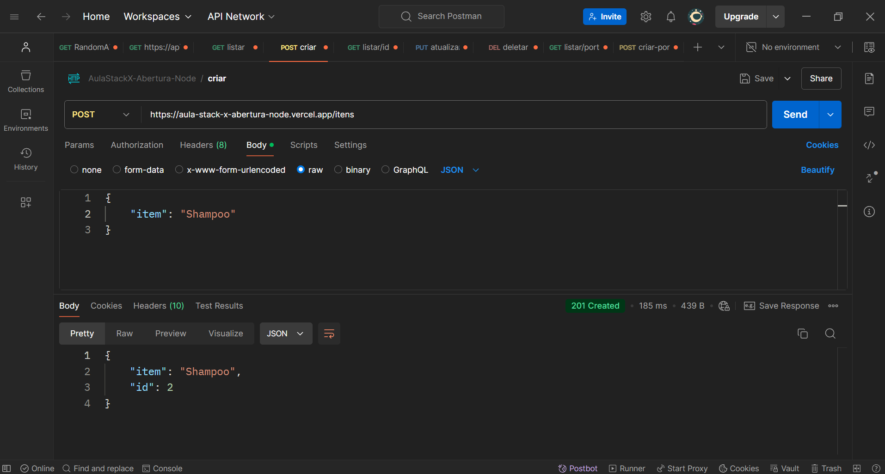

# API de Itens - CRUD
🌟 Bem-vindo à API de Itens! Esta API permite que você realize operações CRUD (Criar, Ler, Atualizar, Deletar) em uma lista de itens. Abaixo estão os detalhes de como utilizar a API, incluindo as rotas disponíveis e exemplos de requisições. ara facilitar a integração e os testes, disponibilizamos uma documentação interativa no ``Postman``, onde é possível explorar todas as funcionalidades, incluindo rotas e exemplos de requisições.

 <div align="center">

 

[ ( Clique aqui para saber mais da documentação) ](https://aula-stack-x-abertura-node.vercel.app/)

<br>

<div align="center">
  
 [Demonstração-Postman] 

 


***

<br>

<div align="left">

## Índice
- Instalação
- Instruções
- Observações

## Instalação com bash
- Clone o repositório:
```
git clone https://github.com/seu-usuario/nome-do-repositorio.git
```
- Navegue até o diretório do projeto:
```
cd nome-do-repositorio
```
- Instale as dependências:
```
npm install express fetch filesystem marked 
```
- OBS: Marked foi instalado permitindo que links, imagens e formatação sejam renderizados corretamente na documentação do Readme.

- Inicie o servidor:
```
npm run nodemon
```
- Que vai já estar no ``package.json``
<br>

- O servidor será iniciado em http://localhost:3000.

<br>

***

##  Instruções para realizar operações de CRUD com itens!  
🔊 Para acessar os itens, adicione '/itens' ao final da URL (https://aula-stack-x-abertura-node.vercel.app/) e atualize a página.

👉 Para começar a usar a API, acesse o link do ``Postman``: (https://www.postman.com/),

✨ Esta ``API`` permite experimentar as seguintes ações:
```    
➕ Use "POST" em (json) para adicionar novos itens incríveis! 
Exemplo de itens
{
    "itens: Shampoo"
}

🔍 Faça uma requisição "GET" para visualizar todos os itens ou por (/ID) selecionando o item .

✏️ Atualize os itens existentes da lista (GET) com uma requisição "PUT".

🗑️ E não esqueça, você pode remover itens com "DELETE" por (/ID) da lista (GET)!",
```

***

### Observações
Para testar a API, você pode usar ferramentas como o Postman ou curl.
A API está configurada para rodar localmente na porta 3000, mas você pode definir uma porta diferente configurando a variável de ambiente PORT.
O servidor retornará uma mensagem de erro 404 se o item não for encontrado para as requisições GET, PUT ou DELETE.

***

## Tecnologias

 Tecnologias utilizadas no projeto:

- ``JavaScript (JS)``:
"Linguagem de Programação do Navegador".
"Scripting Dinâmico para Web".

- ``Node.js``:
"Ambiente de Execução JavaScript do Lado do Servidor".
"Servidor Escalável em JavaScript".

- ``Express.js``:
"Framework Web Minimalista para Node.js".
"Backend Rápido para Aplicações Web".

 - ```Git```
 "Sistema de controle de versões"

- ```Github```
"Plataforma para hospedagem de código-fonte"

- ```Visual Studio Code```
"Editor de código-fonte"

- ```Navegador web```
"Interação documentação de Markdow para HTML"

<br>

***

## Licença

- Esse projeto está sob a licença MIT.

<br>

***

 Autor

<p>
    
    <p>&nbsp&nbsp&nbspRafael Raizer - Dev <br>
    &nbsp&nbsp&nbsp<a href="https://api.whatsapp.com/send/?phone=47999327137">Whatsapp</a>&nbsp;|&nbsp;<a href="https://www.linkedin.com/in/rafael-raizer//">LinkedIn</a>&nbsp;|&nbsp;<a href="https://github.com/RaizerTechDev">GitHub</a>|&nbsp;<a href="https://public.tableau.com/app/profile/rafael.raizer">Tableau</a>|&nbsp;<a href="https://raizertechdev-portfolio.netlify.app/">Portfólio</a>&nbsp;</p>
</p>
